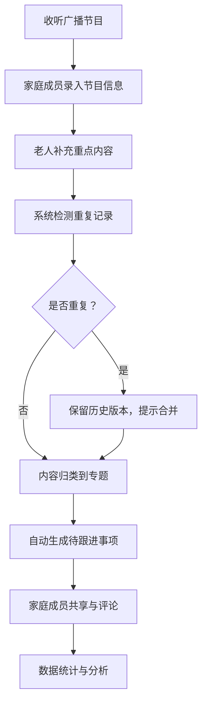

## 1. 产品概述

社区广播节目摘录与家庭共享整理平台，帮助老年人及其家庭成员记录、整理和共享收听的广播节目内容，解决老年人记不住节目播出时间和重要信息的痛点，促进家庭成员间的信息共享和互助。

- **核心目标**：为老年用户及其家庭提供便捷的广播节目内容管理工具
- **目标用户**：老年广播听众及其家属
- **核心价值**：信息不遗漏、家庭共享、专题整理、跟进提醒

## 2. 核心功能

### 2.1 用户角色

| 角色 | 注册方式 | 核心权限 |
|------|----------|----------|
| 家庭成员 | 用户名注册 | 录入节目、编辑内容、查看共享、管理待跟进 |
| 老年用户 | 家庭成员邀请 | 补充重点、查看整理内容、标记感兴趣 |
| 管理员 | 系统配置 | 用户管理、数据统计、系统维护 |

### 2.2 功能模块

1. **节目摘录页**：按日期录入广播节目名称、播出时段、内容摘要，支持老人补充重点
2. **专题整理页**：将内容归类到"社区通知""健康提醒""戏曲节目""便民服务"等专题
3. **家庭共享页**：查看家庭成员录入的内容，支持评论和协作
4. **待跟进事项页**：为家属生成需要后续跟进的事项清单
5. **统计页**：高频收听栏目、专题内容数量、重复记录比例、待确认摘录分布

### 2.3 页面详情

| 页面名称 | 模块名称 | 功能描述 |
|----------|----------|----------|
| 节目摘录页 | 日期选择器 | 选择录入日期，支持历史日期查看 |
| 节目摘录页 | 节目录入表单 | 录入节目名称、播出时段、内容摘要 |
| 节目摘录页 | 老人补充区 | 老人补充重点提醒、感兴趣曲目、主持人口播 |
| 节目摘录页 | 重复记录检测 | 检测相似内容，提示可能的重复记录 |
| 专题整理页 | 专题分类标签 | 社区通知、健康提醒、戏曲节目、便民服务等分类 |
| 专题整理页 | 内容归类操作 | 拖拽或点击将内容归入对应专题 |
| 专题整理页 | 版本历史 | 查看合并前的版本记录，便于核对 |
| 家庭共享页 | 成员列表 | 显示所有家庭成员及其贡献 |
| 家庭共享页 | 共享内容流 | 按时间线展示所有成员录入的内容 |
| 家庭共享页 | 评论互动 | 对内容进行评论和讨论 |
| 待跟进事项页 | 事项列表 | 展示需要家属跟进的事项 |
| 待跟进事项页 | 状态管理 | 标记待处理、处理中、已完成 |
| 待跟进事项页 | 事项生成 | 自动从专题内容中生成待跟进事项 |
| 统计页 | 高频收听栏目 | 柱状图展示收听最多的栏目排名 |
| 统计页 | 专题内容数量 | 饼图展示各专题内容占比 |
| 统计页 | 重复记录比例 | 统计重复记录数量及占比 |
| 统计页 | 待确认摘录分布 | 展示待确认摘录的状态分布 |

## 3. 核心流程

### 主要用户流程

家庭成员收听广播后，按日期录入节目信息（名称、时段、摘要），老年用户可以补充自己记下的重点内容。系统自动检测重复记录，保留合并前版本供核对。用户可将内容归类到不同专题，系统从专题内容中自动生成待跟进事项。所有内容在家庭成员间共享，可进行评论互动。统计页面提供数据可视化分析。

## 4. 用户界面设计

### 4.1 设计风格

**温暖关怀风格**：
- 主色调：温暖橙色 `#FF7A45`（代表活力与关怀）
- 辅助色：柔和蓝色 `#4A90D9`（代表信任与专业）、健康绿色 `#52C41A`（代表健康）
- 背景色：米白色 `#FFF9F0`（温暖舒适）
- 字体：大号字体，便于老年人阅读，标题 20-24px，正文 16-18px
- 按钮：大尺寸圆角按钮（圆角 12px），清晰的点击区域
- 布局：卡片式布局，充足留白，层次分明
- 图标：使用友好的 emoji 和简约图标，避免复杂图形

### 4.2 页面设计概述

| 页面名称 | 模块名称 | UI 元素 |
|----------|----------|----------|
| 节目摘录页 | 日期选择器 | 日历组件，大号日期数字，高亮显示有记录的日期 |
| 节目摘录页 | 节目录入表单 | 大输入框，清晰标签，辅助提示文字 |
| 节目摘录页 | 老人补充区 | 橙色背景区分，更大字号，语音输入按钮 |
| 专题整理页 | 专题分类标签 | 彩色标签，悬停放大动效，点击选中高亮 |
| 专题整理页 | 内容卡片 | 白色卡片，柔和阴影，支持拖拽交互 |
| 家庭共享页 | 成员头像 | 圆形头像，彩色边框区分成员 |
| 家庭共享页 | 时间线 | 垂直时间线，彩色节点标记 |
| 待跟进事项页 | 事项卡片 | 状态标签颜色区分（红/黄/绿），一键完成按钮 |
| 统计页 | 图表区域 | 渐变色图表，大数字统计卡片，动画加载效果 |

### 4.3 响应式

- 桌面优先设计，最小支持宽度 1280px
- 平板自适应布局，卡片重排
- 移动端优化：单列布局，更大点击区域，简化交互
- 触摸优化：按钮最小 48x48px，足够间距

### 4.4 无障碍设计

- 高对比度配色，符合 WCAG AA 标准
- 支持键盘导航
- 语义化 HTML 结构
- 可调节字体大小
- 图标配文字说明
