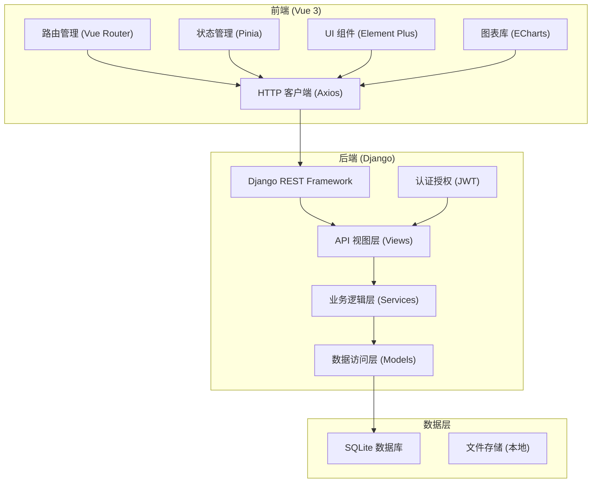
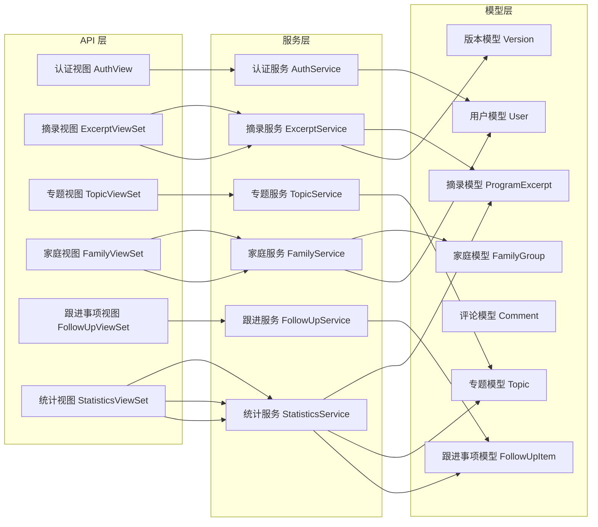
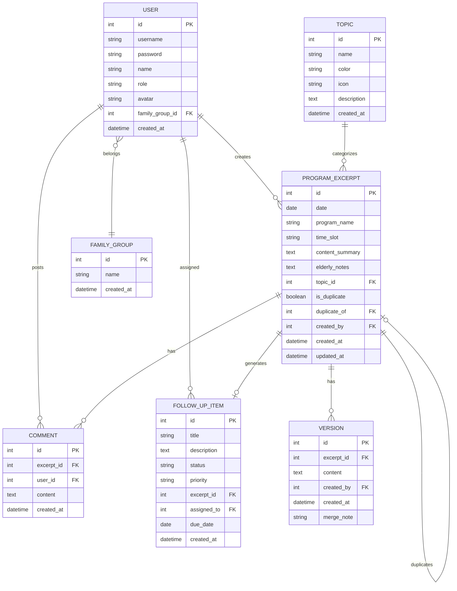

## 1. 架构设计



## 2. 技术描述

### 2.1 技术栈
- **前端框架**: Vue 3 + Vite
- **路由管理**: Vue Router 4
- **状态管理**: Pinia
- **UI 组件库**: Element Plus
- **图表库**: ECharts 5
- **HTTP 客户端**: Axios
- **样式方案**: SCSS + CSS 变量
- **后端框架**: Django 4.2 + Django REST Framework 3.14
- **数据库**: SQLite 3
- **认证方式**: JWT (djangorestframework-simplejwt)
- **CORS 处理**: django-cors-headers

### 2.2 端口配置
- 前端服务端口: 9421
- 后端 API 端口: 9422

## 3. 路由定义

| 路由 | 页面 | 用途 |
|------|------|------|
| `/` | 节目摘录页 | 录入和查看广播节目内容 |
| `/topics` | 专题整理页 | 内容归类和版本管理 |
| `/family` | 家庭共享页 | 家庭成员内容共享和评论 |
| `/followups` | 待跟进事项页 | 管理待处理事项 |
| `/statistics` | 统计页 | 数据可视化分析 |
| `/login` | 登录页 | 用户登录 |

## 4. API 定义

### 4.1 数据类型定义

```typescript
// 节目摘录
interface ProgramExcerpt {
  id: number;
  date: string;
  programName: string;
  timeSlot: string;
  contentSummary: string;
  elderlyNotes: string;
  topicId: number | null;
  isDuplicate: boolean;
  duplicateOf: number | null;
  createdBy: number;
  createdAt: string;
  updatedAt: string;
  versions: Version[];
}

// 专题分类
interface Topic {
  id: number;
  name: string;
  color: string;
  icon: string;
  description: string;
  count: number;
}

// 版本历史
interface Version {
  id: number;
  excerptId: number;
  content: string;
  createdBy: number;
  createdAt: string;
  mergeNote: string;
}

// 家庭成员
interface FamilyMember {
  id: number;
  name: string;
  role: 'elderly' | 'family' | 'admin';
  avatar: string;
  contributionCount: number;
}

// 待跟进事项
interface FollowUpItem {
  id: number;
  title: string;
  description: string;
  status: 'pending' | 'in_progress' | 'completed';
  priority: 'high' | 'medium' | 'low';
  excerptId: number;
  assignedTo: number;
  dueDate: string;
  createdAt: string;
}

// 评论
interface Comment {
  id: number;
  excerptId: number;
  userId: number;
  content: string;
  createdAt: string;
}

// 统计数据
interface Statistics {
  topPrograms: { name: string; count: number }[];
  topicDistribution: { name: string; count: number; color: string }[];
  duplicateRate: { total: number; duplicates: number; rate: number };
  confirmationStatus: { pending: number; confirmed: number; rejected: number };
}
```

### 4.2 API 接口

| 方法 | 路径 | 描述 |
|------|------|------|
| POST | `/api/auth/login/` | 用户登录 |
| GET | `/api/excerpts/` | 获取节目摘录列表 |
| POST | `/api/excerpts/` | 创建节目摘录 |
| GET | `/api/excerpts/:id/` | 获取节目摘录详情 |
| PUT | `/api/excerpts/:id/` | 更新节目摘录 |
| DELETE | `/api/excerpts/:id/` | 删除节目摘录 |
| GET | `/api/excerpts/:id/versions/` | 获取版本历史 |
| POST | `/api/excerpts/:id/merge/` | 合并重复记录 |
| GET | `/api/topics/` | 获取专题列表 |
| POST | `/api/topics/` | 创建专题 |
| PUT | `/api/topics/:id/` | 更新专题 |
| GET | `/api/family/members/` | 获取家庭成员列表 |
| GET | `/api/family/feed/` | 获取家庭共享时间线 |
| GET | `/api/excerpts/:id/comments/` | 获取评论列表 |
| POST | `/api/excerpts/:id/comments/` | 添加评论 |
| GET | `/api/followups/` | 获取待跟进事项列表 |
| POST | `/api/followups/` | 创建待跟进事项 |
| PUT | `/api/followups/:id/` | 更新事项状态 |
| GET | `/api/statistics/` | 获取统计数据 |
| GET | `/api/statistics/export/` | 导出统计报告 |

## 5. 服务器架构图



## 6. 数据模型

### 6.1 ER 图



### 6.2 DDL 语句

```sql
-- 家庭组
CREATE TABLE family_group (
    id INTEGER PRIMARY KEY AUTOINCREMENT,
    name VARCHAR(100) NOT NULL,
    created_at DATETIME DEFAULT CURRENT_TIMESTAMP
);

-- 用户表
CREATE TABLE user (
    id INTEGER PRIMARY KEY AUTOINCREMENT,
    username VARCHAR(50) UNIQUE NOT NULL,
    password VARCHAR(255) NOT NULL,
    name VARCHAR(100) NOT NULL,
    role VARCHAR(20) NOT NULL DEFAULT 'family',
    avatar VARCHAR(255),
    family_group_id INTEGER REFERENCES family_group(id),
    created_at DATETIME DEFAULT CURRENT_TIMESTAMP
);

-- 专题表
CREATE TABLE topic (
    id INTEGER PRIMARY KEY AUTOINCREMENT,
    name VARCHAR(50) NOT NULL,
    color VARCHAR(20) NOT NULL,
    icon VARCHAR(50) NOT NULL,
    description TEXT,
    created_at DATETIME DEFAULT CURRENT_TIMESTAMP
);

-- 节目摘录表
CREATE TABLE program_excerpt (
    id INTEGER PRIMARY KEY AUTOINCREMENT,
    date DATE NOT NULL,
    program_name VARCHAR(200) NOT NULL,
    time_slot VARCHAR(50) NOT NULL,
    content_summary TEXT NOT NULL,
    elderly_notes TEXT,
    topic_id INTEGER REFERENCES topic(id),
    is_duplicate BOOLEAN DEFAULT FALSE,
    duplicate_of INTEGER REFERENCES program_excerpt(id),
    created_by INTEGER REFERENCES user(id) NOT NULL,
    created_at DATETIME DEFAULT CURRENT_TIMESTAMP,
    updated_at DATETIME DEFAULT CURRENT_TIMESTAMP
);

-- 版本历史表
CREATE TABLE version (
    id INTEGER PRIMARY KEY AUTOINCREMENT,
    excerpt_id INTEGER REFERENCES program_excerpt(id) NOT NULL,
    content TEXT NOT NULL,
    created_by INTEGER REFERENCES user(id) NOT NULL,
    created_at DATETIME DEFAULT CURRENT_TIMESTAMP,
    merge_note VARCHAR(500)
);

-- 评论表
CREATE TABLE comment (
    id INTEGER PRIMARY KEY AUTOINCREMENT,
    excerpt_id INTEGER REFERENCES program_excerpt(id) NOT NULL,
    user_id INTEGER REFERENCES user(id) NOT NULL,
    content TEXT NOT NULL,
    created_at DATETIME DEFAULT CURRENT_TIMESTAMP
);

-- 待跟进事项表
CREATE TABLE follow_up_item (
    id INTEGER PRIMARY KEY AUTOINCREMENT,
    title VARCHAR(200) NOT NULL,
    description TEXT,
    status VARCHAR(20) NOT NULL DEFAULT 'pending',
    priority VARCHAR(20) NOT NULL DEFAULT 'medium',
    excerpt_id INTEGER REFERENCES program_excerpt(id),
    assigned_to INTEGER REFERENCES user(id),
    due_date DATE,
    created_at DATETIME DEFAULT CURRENT_TIMESTAMP
);

-- 初始化专题数据
INSERT INTO topic (name, color, icon, description) VALUES
('社区通知', '#FF7A45', '📢', '社区广播中的重要通知公告'),
('健康提醒', '#52C41A', '💚', '养生栏目中的健康知识和提醒'),
('戏曲节目', '#4A90D9', '🎭', '戏曲频道的节目和曲目信息'),
('便民服务', '#FAAD14', '🛠️', '便民服务信息和活动通知');

-- 初始化测试用户
INSERT INTO family_group (name) VALUES ('幸福一家人');

INSERT INTO user (username, password, name, role, avatar, family_group_id) VALUES
('grandpa', 'pbkdf2_sha256$...', '张爷爷', 'elderly', '👴', 1),
('daughter', 'pbkdf2_sha256$...', '张女儿', 'family', '👩', 1),
('son', 'pbkdf2_sha256$...', '张儿子', 'family', '👨', 1);
```
